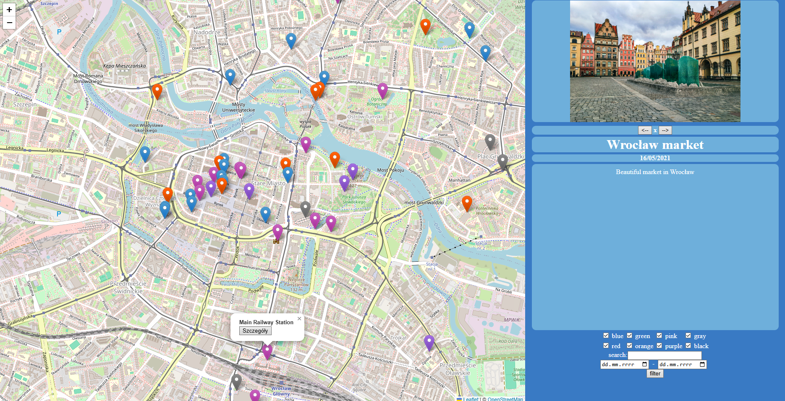

# Map - Diary
Project created primarly as a gift and personal use.

Version 1.2

### License

Using open-source js library Leaflet
https://leafletjs.com/

### How to use
Open page.html to run map. 

See following sections to see how to customize map with your own points and photos.
### Adding points to the map

All data regarding map points are contained in mapdata dictionary.

To add new points, add line in mapdata.js file in format:
x, y, name, dates, type, photos, description

x, y - are the map coordinates, Latitude and Longitude
name - point's title
dates - dates used to filter points. In dd/mm/yyyy format. Next dates must be separeted by a colon. There is possibility to write a range of dates dd/mm/yyyy-dd/mm/yyyy. It's safest to not write any white spaces inside. Example of correct date format:
19/07/2023-24/07/2023:26/07/2023
type - number in range 0-7, represents 8 possible tags with which you can filter the points. Each one has  a color assigned to them: blue, red, green, orange, pink, purple, gray and black. More about types in separate section.
photos - names of image files, separated by colons. Must be placed in mapdata/photos directory. Best not to contain any white spaces. 
description - description of event or place written in html. Use \  element as a new line character. All other elements are available e. g. \
 or \<strong>. It is prohibited to use any commas or semicolons and it should be written in one line of text.

Every next entry must be separeted by semicolon.
Sample content of mapdata.js file:

const MAPDATA = \`
51.1100, 17.03185, Wrocław market, 16/05/2021, 3, wroclaw.jpeg, Beautiful market in Wrocław; 
50.7925, 15.5137, Szrenica, 12/07/2019, 2, szrenica.jpeg, Is a mountain peak situated in the western part of Giant Mountains in Poland, within the Karkonosze National Park.;
50.7360, 15.7398, Śnieżka, 24/09/2019, 0, sniezka.png:sniezka 2.jpg:sniezka 3.jpg, The most prominent point of the Silesian Ridge in the Giant Mountains.;
49.2513, 19.9339, Giewont, 16/10/2020, 2, giewont.png:giewont 2.jpg, Crazy weather allowed amazing photos;
49.8230, 19.0483, Reksio monument, 02/02/2021, 6, reksio.webp, Everyones favorite fairy tale;
`;

### Managing tags

In mapdata/markers.js there are located names of tags, which are then displayed in bottom right corner of page as filters. Those can be renamed but the count of them should not be changed.

### Changing the starting point

Coordinates of map's starting view are located in mapdata/startpoint.js file. There are saved in the following format:

const START_POINT = [x, y];
const ZOOM_LEVEL = z;

### Data export

It is possible to export all point's data without downloading whole repository. Everything that needs to be done is to copy the mapdata directory. It contains all data about map's points.

### Filtering 

Filter button allows to hide some points on map that does not fit the criteria.
With checkboxes you can filter by tag types.
Write phrase in "search" input to show only those points that contains these words in title or description.
It is also possible to filter by date.